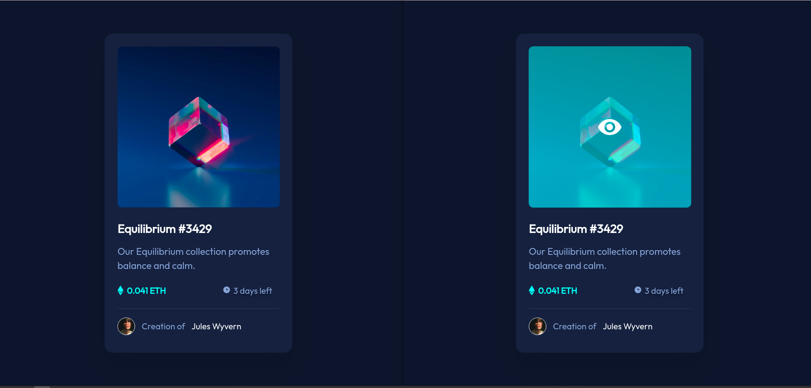

# Frontend Mentor - NFT preview card component solution

This is a solution to the [NFT preview card component challenge on Frontend Mentor](https://www.frontendmentor.io/challenges/nft-preview-card-component-SbdUL_w0U).

## Table of contents

- [Overview](#overview)
  - [The challenge](#the-challenge)
  - [Screenshot](#screenshot)
  - [Links](#links)
- [My process](#my-process)
  - [Built with](#built-with)
  - [What I learned](#what-i-learned)
  - [Continued development](#continued-development)
  - [Useful resources](#useful-resources)
- [Author](#author)

## Overview

### The challenge

Users should be able to:

- View the optimal layout depending on their device's screen size
- See hover states for interactive elements

### Screenshot

### Links

- Solution URL: [GitHub/MeryGoodernak](https://github.com/MeryGoodernak/NFT-preview-card-component)

## My process

### Built with

- Semantic HTML5 markup
- CSS custom properties
- Flexbox
- Mobile-first workflow
- React

### What I learned

I learned:
- Break down the project into small components in oroder to develop with React component.
- Use relative length units in styling to implement responsive pages.

### Continued development

- Add different **themes** among which user can select .
- Arrange several instans of nft-preview-card-component next to each other in reponsive mobile-first webpage.

### Useful resources

- [React tutorial](https://reactjs.org/tutorial/tutorial.html) - This tutorial helped me how to start with React and how to break down the project into small component and develop them with React. The tutorial is easily comprehensible and useful for who want to get start with React. I really liked this pattern and will use it going forward.
- [MDN Web Docs - CSS](https://developer.mozilla.org/en-US/docs/Web/CSS) - Any question that I have about CSS or other open web technologies I can easily find the answer on this website. MDN elaborates all subjects through the various examples and has been perfectly categorized.

- Frontend Mentor - [@MeryGoodernak](https://www.frontendmentor.io/profile/MeryGoodernak)
